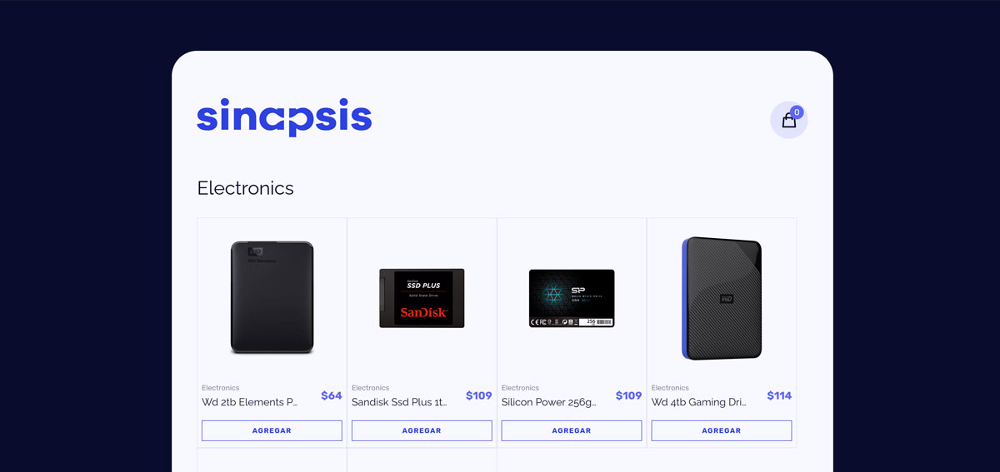

# eshop-sinapsis

Technical challenge for the Synapsis Group for frontend position.
This project was generated using [Angular CLI](https://github.com/angular/angular-cli) version 19.1.6.

To develop this challenge, I used **the Fake Shop API** [https://fakestoreapi.com/docs](https://fakestoreapi.com/docs) to facilitate data collection.



## To use this project 

### 1) Clone this repository using the following command.
```bash
git clone https://github.com/luisangelsalcedo/eshop-sinapsis.git
```

### 2) Enter the directory of the cloned project
```bash
cd ./eshop-sinapsis/
```
### 3) Build the node_modules.
```bash
npm i 
```


### 4) To start a local development server, run:
```bash
ng serve -o
```

Once the server is running, open your browser and navigate to `http://localhost:4200/`. The application will automatically reload whenever you modify any of the source files.


## My planning
I made it using the notion tool
[View planning](https://luissg.notion.site/eshop-sinapsis-1925f48e87f98074a66ad9e071a09f2d?pvs=74)